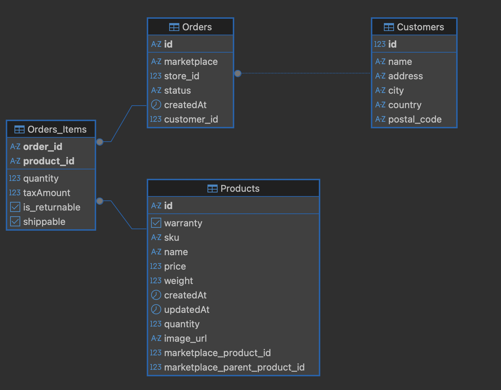

# Backend Challenge Labl - Lucas Pimentel

## How to run

1. Build and start the application:
   ```bash
   docker-compose up --build
   ```

2. The application will be available at `http://localhost:3000`

3. To stop the application:
   ```bash
   docker-compose down
   ```

## API Endpoints

- `GET /orders` - Returns orders from the database based on the optional query params
- `POST /orders` - Insert the order in the database

## Thought Process
The thought process was guided by the instructions provided for the challenge. I first focused on the essential parts: modeling the database and ensuring the API was functional, and only then moved on to the additional challenges.

For the API design, I chose to follow the Clean Architecture approach along with SOLID principles, keeping in mind potential future scalability and the integration of multiple marketplace webhooks. While this might be considered over-engineering for the scope of this challenge, the goal was to demonstrate theoretical knowledge and create a foundation that could support scalability while ensuring maintainability of the project.

Regarding the application infrastructure, I decided to use a containerized environment with Docker. This simplifies the execution of the project for reviewers, removing the need for local installations of additional tools or dependencies.

Finally, for the extra challenges, I conducted benchmarks using Postgres’s EXPLAIN ANALYZE command to measure query execution times.
## Database
### Database Design 

The database design was based on the provided sample JSON file. From it, I identified Order as the main entity, supported by two auxiliary entities: Product and Customer, both related to Order.

These relationships were modeled according to the sample JSON structure, where each Order belongs to a single Customer (1:n), and an Order can include multiple Products (m:n).

As a result, the schema was designed as illustrated in the figure below:


### Idexing 
The indexing strategy was designed based on the most common queries executed against the database and the existing relationships between its entities.

Specifically, the customer_id field in the Order table was indexed to optimize join operations. 

Additionally, the createdAt and storeId attributes were indexed because they are frequently used as optional query parameters in the API. The warranty attribute in the Product table was also indexed for the same reason.
### Benchmarks
#### Without indexes
##### Unfiltered
```sql
EXPLAIN ANALYZE
SELECT 
    o.id as order_id,
    o.marketplace,
    o.status,
    o."createdAt",
    c.name as customer_name,
    c.city,
    c.country,
    p.name as product_name,
    p.sku,
    p.price,
    oi.quantity,
    oi."taxAmount",
    oi."is_returnable",
    oi.shippable
FROM "Orders" o
JOIN "Customers" c ON o.customer_id = c.id
JOIN "Orders_Items" oi ON o.id = oi.order_id
JOIN "Products" p ON oi.product_id = p.id;
```
Execution Time: 27.273 ms

##### Filtered

```sql
EXPLAIN ANALYZE
SELECT 
    o.id as order_id,
    o.marketplace,
    o.status,
    o."createdAt",
    c.name as customer_name,
    c.city,
    c.country,
    p.name as product_name,
    p.sku,
    p.price,
    oi.quantity,
    oi."taxAmount",
    oi."is_returnable",
    oi.shippable
FROM "Orders" o
JOIN "Customers" c ON o.customer_id = c.id
JOIN "Orders_Items" oi ON o.id = oi.order_id
JOIN "Products" p ON oi.product_id = p.id
WHERE p.warranty = false;
```
Execution Time: 20.539 ms

#### With indexes
##### Unfiltered
```sql
EXPLAIN ANALYZE
SELECT 
    o.id as order_id,
    o.marketplace,
    o.status,
    o."createdAt",
    c.name as customer_name,
    c.city,
    c.country,
    p.name as product_name,
    p.sku,
    p.price,
    oi.quantity,
    oi."taxAmount",
    oi."is_returnable",
    oi.shippable
FROM "Orders" o
JOIN "Customers" c ON o.customer_id = c.id
JOIN "Orders_Items" oi ON o.id = oi.order_id
JOIN "Products" p ON oi.product_id = p.id;
```
Execution Time: 26.153 ms

##### Filtered

```sql
EXPLAIN ANALYZE
SELECT 
    o.id as order_id,
    o.marketplace,
    o.status,
    o."createdAt",
    c.name as customer_name,
    c.city,
    c.country,
    p.name as product_name,
    p.sku,
    p.price,
    oi.quantity,
    oi."taxAmount",
    oi."is_returnable",
    oi.shippable
FROM "Orders" o
JOIN "Customers" c ON o.customer_id = c.id
JOIN "Orders_Items" oi ON o.id = oi.order_id
JOIN "Products" p ON oi.product_id = p.id
WHERE p.warranty = false;
```
Execution Time: 19.254 ms

## Further Scaling

For further scaling of the application, considering cloud hosting, I would opt to use a database proxy to manage connections. This would prevent connection overload and allow efficient reuse of connections through pooling.

Additionally, introducing read replicas for the database would help distribute the load, ensuring that a single instance is not responsible for handling both read and write operations.

To improve query performance, I would add a read-through cache, so that the database is only queried in the event of a cache miss. On a cache hit, the cache would return the data directly, significantly reducing latency.

Regarding the API architecture, it could continue following the current model with additional marketplace integrations, or it could be migrated to a serverless environment using AWS Lambda. In this approach, each marketplace integration could be handled by a dedicated Lambda function to store data in the database, while another function, exposed through an API Gateway, could serve as the endpoint for queries.

This decision would require evaluating the cost and performance trade-offs: while Lambda might be more cost-effective, it could introduce performance drawbacks due to cold starts.